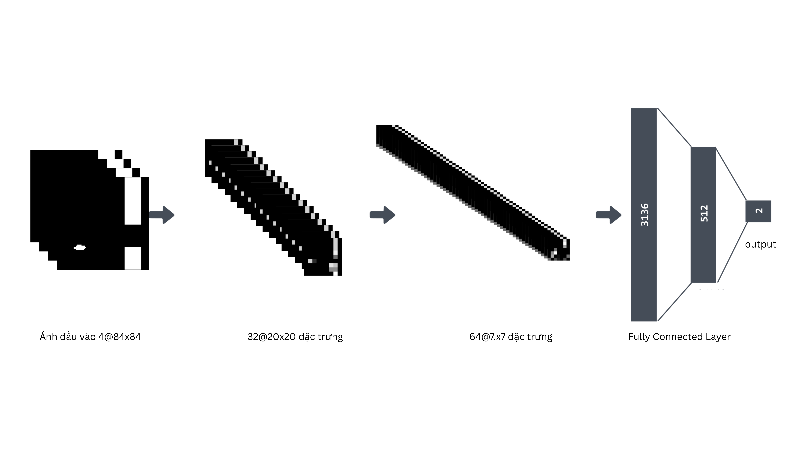

# Học Flappy Bird với PPO (PyTorch)


Dự án này sử dụng học tăng cường với CNN + PPO để huấn luyện tác tử chơi Flappy Bird từ ảnh màn hình. Môi trường game được dựng bằng Pygame, tiền xử lý bằng OpenCV, mô hình và huấn luyện bằng PyTorch.

## Cấu trúc dự án (bỏ qua thư mục `backup/`)

- `assets/`: tài nguyên hình ảnh game (nền, ống, chim).
- `src/`
  - `flappy_bird.py`: môi trường Flappy Bird dựa trên Pygame, xuất trạng thái dạng ảnh đã tiền xử lý.
  - `utils.py`: hàm tiền xử lý ảnh (resize 84×84, chuyển grayscale, threshold).
- `train_ppo_good.py`: huấn luyện PPO ổn định cho Flappy Bird (khuyến nghị dùng file này).
- `train_ppo_bad.py`: phiên bản PPO kém ổn định (tham khảo).
- `train_dqn.py`: thử nghiệm DQN (tham khảo).
- `trained_models/`: thư mục lưu checkpoint mô hình.
- `tensorboard_ppo/`: log TensorBoard trong quá trình huấn luyện.
- `flappy_bird/` và `image/`: hình minh họa, biểu đồ.

Lưu ý: Thư mục `backup/` chứa mã và tài nguyên dự phòng, không dùng cho chạy chính.

## Yêu cầu môi trường

- Python 3.8+ (khuyến nghị 3.9/3.10)
- PyTorch (phiên bản có CUDA nếu dùng GPU)
- Pygame
- OpenCV-Python
- NumPy
- TensorBoard
- Matplotlib

Cài đặt nhanh (ví dụ dùng pip):

```bash
pip install torch torchvision torchaudio --index-url https://download.pytorch.org/whl/cu121  # hoặc dùng bản cpu
pip install pygame opencv-python numpy tensorboard matplotlib
```

## Dữ liệu và tài nguyên

- Hình ảnh trong `assets/sprites/` là bắt buộc để game hiển thị và mô phỏng đúng.
- Âm thanh không bắt buộc cho huấn luyện, đã được lược bỏ khỏi `assets/audio/` trong phiên bản này.

## Cách chạy huấn luyện PPO

Chạy lệnh:

```bash
python3 train_ppo_good.py
```

Các tham số quan trọng (có thể truyền qua CLI trong `train_ppo_good.py`):

- `--lr`: learning rate (mặc định 1e-5)
- `--gamma`: hệ số chiết khấu (0.99)
- `--num_iters`: số vòng lặp huấn luyện (20000)
- `--log_path`: đường dẫn log TensorBoard (`tensorboard_ppo`)
- `--saved_path`: nơi lưu mô hình (`trained_models`)
- `--lmbda`: GAE lambda (0.95)
- `--epochs`: số epoch cập nhật mỗi lần
- `--batch_size`, `--mini_batch_size`: kích thước batch/mini-batch

Theo mặc định, tác tử sẽ tương tác với môi trường Pygame, thu thập dữ liệu vào buffer, và định kỳ cập nhật actor-critic theo mục tiêu PPO (clip).

### Theo dõi TensorBoard

```bash
tensorboard --logdir tensorboard_ppo
```

## Ghi chú về phần cứng (CUDA/CPU)

Mã hiện tại mặc định sử dụng GPU CUDA (gọi `.cuda()` cho tensor và mô hình). Nếu không có GPU:

- Cách nhanh: đổi sang dùng device động (ví dụ: `device = torch.device("cuda" if torch.cuda.is_available() else "cpu")`) và thay các chỗ `.cuda()` thành `.to(device)`. Thực hiện tương tự ở `src/flappy_bird.py` nơi tạo `state`.
- Hoặc dùng máy có GPU NVIDIA + CUDA tương thích để giữ nguyên mã.

## Tiền xử lý ảnh

Ảnh gốc (288×512) được:

- resize về 84×84,
- chuyển grayscale,
- threshold thành ảnh nhị phân,
- cắt bỏ nền phía dưới (base) để giảm nhiễu,
- xếp chồng 4 khung hình gần nhất thành input cho mạng CNN.

Minh họa:




## Đầu ra và checkpoint

- Mô hình được lưu định kỳ vào `trained_models/`:
  - `flappy_bird_actor_good`
  - `flappy_bird_critic_good`
- Log huấn luyện nằm trong `tensorboard_ppo/`.

## Sự cố thường gặp

- Cửa sổ Pygame không hiển thị: kiểm tra quyền đồ họa, biến môi trường hiển thị (đặc biệt khi chạy qua SSH).
- Không có GPU: sửa mã sang `.to(device)` như ghi chú phía trên.
- Thiếu tài nguyên ảnh: đảm bảo `assets/sprites/*.png` tồn tại đúng đường dẫn tương đối khi chạy.

## Tài liệu tham khảo

- http://cs229.stanford.edu/proj2015/362_report.pdf
- https://github.com/uvipen/Flappy-bird-deep-Q-learning-pytorch
- https://zh.d2l.ai/chapter_convolutional-neural-networks/why-conv.html
- https://github.com/Lizhi-sjtu/DRL-code-pytorch/blob/main/4.PPO-discrete/ppo_discrete.py
- https://arxiv.org/pdf/1707.06347.pdf
- https://huggingface.co/blog/deep-rl-ppo
- https://iclr-blog-track.github.io/2022/03/25/ppo-implementation-details/

---
